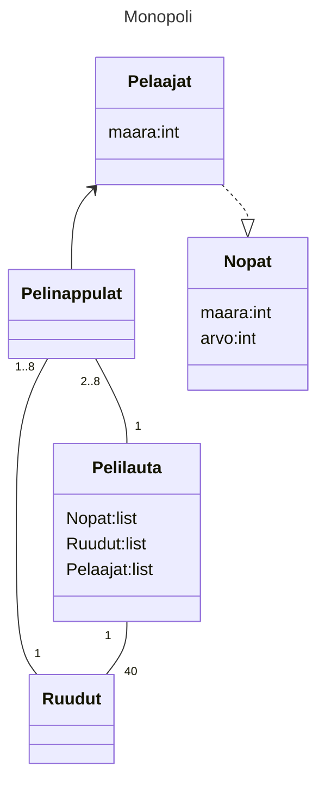

```mermaid
---
title: Monopoli
---
classDiagram

    Pelaajat <-- Pelinappulat
    Pelaajat ..|> Nopat
    Pelinappulat "2..8" -- "1" Pelilauta
    Pelinappulat "1..8" -- "1" Ruudut
    Pelilauta "1" -- "40" Ruudut
    


    class Nopat{
        maara:int
        arvo:int
    }
    class Pelaajat{
        maara:int
    }
    class Pelilauta{
        Nopat:list
        Ruudut:list
        Pelaajat:list
    }
    class Ruudut{
    }
    class Pelinappulat{    
    }
```